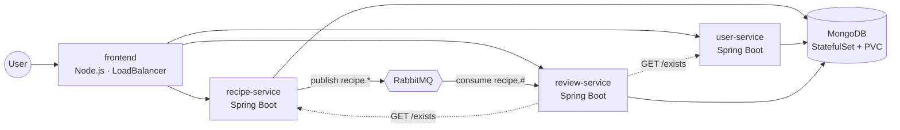

# EAD CA Repeat — Enterprise Microservice CI/CD Deployment

TU Dublin M.Sc. in DevOps — **Enterprise Architecture Deployment (ENTP H6000)**, CA Repeat (PT).
A four-service recipe platform delivered to Azure Kubernetes Service through a fully automated pipeline.

## Architecture



| Service | Stack | Entity | Notes |
|---|---|---|---|
| `frontend` | Node.js 20 / Express | — | Only externally exposed workload |
| `recipe-service` | Java 17 / Spring Boot | Recipe | Publishes lifecycle events |
| `user-service` | Java 17 / Spring Boot | User | BCrypt credential handling |
| `review-service` | Java 17 / Spring Boot | Review | References Recipe + User; blue/green slot |

**Four services, one data layer, three entities** — satisfying the brief's minimum of four services and two entities.

## Repository layout

```
services/            four microservices, each with Dockerfile and tests
infrastructure/
  helm/ead-platform/ chart rendering 24 Kubernetes objects
  terraform/         azurerm provisions the AKS cluster itself
.github/workflows/   ci.yml · cd.yml · infrastructure.yml
scripts/             rollback, blue/green switch, backup and restore
docs/demo-script.md  segment-by-segment recording script (<=20 min)
```

## Deployment strategies

Two strategies, matched to risk profile:

| Strategy | Applied to | Rollback |
|---|---|---|
| **RollingUpdate** (`maxUnavailable: 0`) | recipe, user, frontend | `kubectl rollout undo` |
| **Blue/Green** (Service selector pinned to `activeColour`) | review-service | Selector switch — the previous slot never stopped running |

```bash
./scripts/switch-colour.sh green    # promote, after smoke-testing the idle slot
./scripts/rollback.sh bluegreen     # revert
./scripts/rollback.sh rolling recipe-service
./scripts/rollback.sh helm
```

## Additional features (not taught in the module)

| Technology | Role |
|---|---|
| **Argo CD** | GitOps reconciliation with `selfHeal` drift correction |
| **RabbitMQ** | Asynchronous inter-service messaging via topic exchange |
| **KEDA** | Autoscaling on queue depth rather than CPU |

Verified against every lecture, lab and demo script in Weeks 1–11 plus the Week 2 guest material. Prometheus, Grafana, Istio and Trivy were checked and **rejected** as additional features because the module covers them.

## Quick start

```bash
# 1. Provision infrastructure (creates the AKS cluster from nothing)
cd infrastructure/terraform
cp example.tfvars terraform.tfvars     # then edit
terraform init && terraform apply

# 2. Connect kubectl
az aks get-credentials --resource-group <rg> --name <cluster> --overwrite-existing

# 3. Deploy the platform
helm upgrade --install ead ../helm/ead-platform \
  --namespace ead-platform --create-namespace \
  -f ../helm/ead-platform/values-blue.yaml --wait

# 4. Resolve the public URL
kubectl -n ead-platform get svc frontend \
  -o jsonpath='{.status.loadBalancer.ingress[0].ip}'

# 5. Tear everything down (no lingering cost)
terraform destroy
```

## Local verification (no cluster required)

```bash
cd services/recipe-service && mvn test     # 6 tests
cd services/user-service   && mvn test     # 7 tests
cd services/review-service && mvn test     # 6 tests
cd services/frontend       && npm test     # 10 tests

helm lint infrastructure/helm/ead-platform
helm template ead infrastructure/helm/ead-platform
terraform -chdir=infrastructure/terraform validate
```

## Backup and restore

```bash
./scripts/backup-mongodb.sh                                       # mongodump inside the pod
./scripts/restore-mongodb.sh backups/mongodb-<stamp>.archive.gz   # idempotent (--drop)
```

## Security posture

- Non-root UID 10001, `readOnlyRootFilesystem`, all capabilities dropped, `RuntimeDefault` seccomp
- Pod Security Admission: `enforce=baseline`, `audit=restricted`
- NetworkPolicy default-deny; only the frontend is externally reachable
- Secrets generated by Terraform `random_password`; no credential in source control
- Trivy gates the build on unfixed CRITICAL findings; SARIF published to code scanning

Three defects in the supplied starter project were found and fixed: MongoDB credentials hard-coded in two places, and `actuator` exposing the `env` endpoint, which served the entire configuration — including those credentials — over HTTP.

## Deliverables

- Release Management Plan report (~2,300 words, Harvard referencing) → exported to PDF
- Demonstration video — script at [docs/demo-script.md](docs/demo-script.md)
