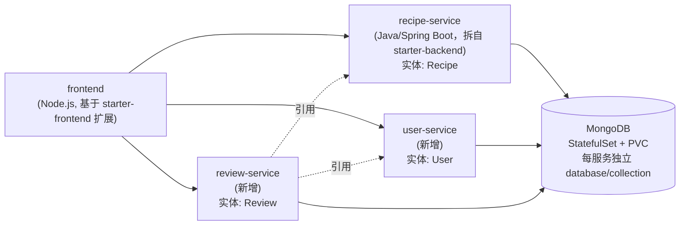

# 实施方案：架构设计 + 技术选型 + 执行计划

## 1. 微服务架构设计

起始代码只有 FE + BE(Recipe) + MongoDB 共2个服务，需要拆分/新增到 **至少4个服务、至少2个不同实体**。方案：

- **4个服务**：frontend、recipe-service、user-service、review-service
- **数据层**：1个 MongoDB（StatefulSet+PVC），每个服务用独立 database 或 collection，逻辑隔离（满足"database-per-service"精神但不必开多个MongoDB实例，节省时间）
- **≥2个不同实体**：Recipe、User、Review（共3个，超出最低要求）
- review-service 通过 recipe_id / user_id 关联另外两个实体，天然满足"服务间通信"演示需求

## 2. 技术选型 ↔ 评分项对照

| 评分项 | 分值 | 技术选择 | 对应课程周次 |
|---|---|---|---|
| CI Working & Tasks | 10 | GitHub Actions：lint → test → build → 镜像扫描 → push | （前置模块 CSFD 假设已掌握） |
| CD Working & Tasks | 4 | `helm upgrade` / `kubectl apply` 自动部署 | W03, W04 |
| ├ 部署策略 | 4 | **两种**：RollingUpdate + Blue/Green | W05（现成YAML可套用） |
| ├ 监控 | 4 | Liveness/Readiness 探针 + HPA | W06 |
| ├ 安全 | 4 | SecurityContext + Secrets + Trivy/Docker Scout 扫描 | W07 |
| 持久层 | 4 | MongoDB StatefulSet + PVC + Headless Service | W04 |
| Infrastructure as Code | 10 | Terraform（K8s Provider，最好也 provision 集群本身） | W11 |
| 演示 | 10 | 录屏（≤20分钟）| — |
| RMP报告 | 30 | 按官方大纲撰写，~2000字 | — |
| 附加功能 | 20 | 见下 §4（选≥3个模块未教过的技术） | — |

## 3. 部署策略：选择 RollingUpdate + Blue/Green

- **RollingUpdate**：默认策略，Helm/K8s Deployment 原生支持，风险最低，作为"基础"策略。
- **Blue/Green**：W05 demo_cmds 提供了完整可套用的 `blue-service-manifest.yaml` / `green-service-manifest.yaml` 模式（两个 Deployment + 按 label 切换流量的 Service），改造成 recipe-service 或 user-service 的发布流程即可，风险可控且能清楚演示"切换 + 回滚"。
- Canary 可作为文档中讨论但不强制实现的"备选方案"（对比分析，充实报告的批判性评估部分）。

## 4. 附加功能选择（至少3个，需为模块未教过的技术）

优先级从高到低：

1. **ArgoCD**（GitOps 持续部署）——呼应"provisioning 真正自动化"的硬性要求，且未在课程中动手教过。
2. **Prometheus + Grafana**（完整监控告警栈）——W10 只提到名字未动手教，能显著加强"监控"论证与可视化演示效果。
3. **RabbitMQ 或 Kafka**（服务间异步通信）——让 review-service 通知 recipe-service/user-service 时用消息队列而非同步 REST，真实提升架构质量，且未在课程中教过。

备选（时间充裕可加）：
- Trivy/OWASP ZAP 动态安全扫描网关
- Istio 服务网格（流量管理、更精细的 Canary）
- OpenCost（W10提到，可做成本/可持续性看板佐证 Sustainability 报告章节）

## 5. Infrastructure as Code 细节

- `infrastructure/terraform/providers.tf`：声明 Kubernetes provider（连接 Minikube 或 AKS）
- `infrastructure/terraform/k8s.tf`：声明 namespace、Deployment、Service 资源（W11 demo_cmds 现成模板可扩展到4个服务）
- 加分项：用 Terraform 的 `azurerm` provider 直接 provision AKS 集群本身（而不仅是集群内对象），进一步强化"全自动 provisioning"论证
- `terraform destroy` 必须能完整销毁重建 —— 报告里要专门讨论这一点（对应"可靠自动化销毁重建"硬性要求）

## 6. 集群选择：Minikube（本地，零成本）vs AKS（云端）

> ⚠️ Brightspace dropbox 说明明确要求「报告必须包含 Services 的 URL 和 CI/CD pipelines 的 URL」。纯 Minikube 部署没有可对外访问的 URL，**不能作为唯一方案**。

| | Minikube | Azure AKS |
|---|---|---|
| 成本 | 免费 | 需要 Azure for Students 额度，用完即需销毁 |
| 可提供公网 Service URL | ❌ 仅本地 | ✅ LoadBalancer/Ingress 公网 IP |
| GitHub Actions 可达性 | 需要自托管 runner（在自己机器上跑 minikube） | GitHub 托管 runner 可直接连 |
| 课程覆盖度 | W01/W04/W05/W06/W07 demo 默认用 Minikube | W03 专门教 AKS |

**结论**：以 **AKS 为最终交付目标**（提供报告所需的公网 Service URL），Minikube 仅作为本地开发/调试环境。CI/CD Pipeline URL 用 GitHub Actions 的 workflow run 链接。录完演示视频后立即 `terraform destroy` / `az group delete` 销毁资源。

## 7. 10天执行计划（2026-08-13 → 2026-08-23 22:59 截止）

- [ ] **Day1 (8/13)** 环境搭建：Docker Desktop / Minikube / kubectl / Helm / Terraform / GitHub CLI；确认起始代码可本地跑通
- [ ] **Day2 (8/14)** 敲定4服务拆分方案；把 `starter-backend` 的 Recipe 逻辑迁到 `recipe-service`；起草 `user-service` 骨架
- [ ] **Day3 (8/15)** 完成 `user-service`、`review-service` 基本 CRUD；每个服务写 Dockerfile；本地 docker run 联调
- [ ] **Day4 (8/16)** 编写 Helm chart（4服务 + MongoDB StatefulSet+PVC）；部署到 Minikube 跑通端到端流程
- [ ] **Day5 (8/17)** 搭建 GitHub Actions CI：build → test → Trivy/Docker Scout 扫描 → push 镜像
- [ ] **Day6 (8/18)** 打通 CD 自动化 + 实现 RollingUpdate 和 Blue/Green 两种部署策略演示；加上探针和 HPA
- [ ] **Day7 (8/19)** 安全加固（SecurityContext/Secrets/Namespace隔离）；编写 Terraform IaC 脚本
- [ ] **Day8 (8/20)** 实现≥3个附加功能（ArgoCD / Prometheus+Grafana / 消息队列）
- [ ] **Day9 (8/21)** 撰写 RMP 报告（~2000字，按官方大纲，Harvard引用，GenAI使用附录）
- [ ] **Day10 (8/22)** 录制演示视频（≤20分钟）；清理云资源；提前提交（不要卡在8/23最后一刻）
